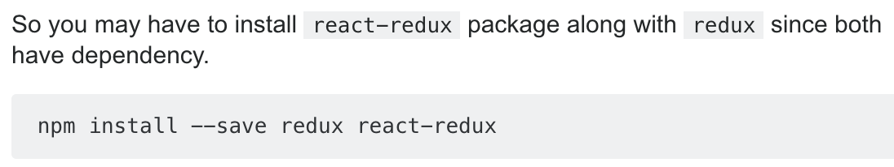

# React 실전 심화 스터디

## 송동욱 김후정 배민근
---

### 목차

- 1일차 - React 기본
- 2일차 - Redux
- 3일차 - Mobx, immer.js
- 4일차 - SASS, styled-components, CSS Module
- 5일차 - Webpack, Babel, Serviceworker, Next.js
- 실습 - 부딪혔던 실수들

---

### 1일차 - React

저번 주에 대표님과 미팅을 가졌습니다. React 프레임워크를 이용하여 <https://www.popinbridge.com/> 홈페이지의 Front end를 리뉴얼할 예정입니다. 그래서 4월 1일부터 외주 전까지 실전에서 사용되는 방법들을 빠르게 스터디를 진행하였습니다. (외주는 5월부터 시작될 예정입니다.)

1일차에는 <https://velopert.com> 의 React핵심강좌를 1강에서 10강까지 훑었으며, 실습으로 phone form을 제작합니다.

참조한 사이트는 다음과 같습니다.

<https://velopert.com/3613>

---

### 2일차 - Redux

2일차에는 Redux의 개념을 살펴보는 시간을 가졌습니다. Redux에 대해 간단하게 소개하자면, 기존에 React가 여러 컴포넌트를 거쳐서 props를 전달하던 비효율적인 방법을 개선, 상태 관리를 컴포넌트의 밖에서 처리하는 것입니다. 다음과 같은 개념들이 있습니다.

- 스토어 : 어플리케이션의 상태 값들을 내장하고 있습니다.
- 액션 : 상태 변화를 일으킬 때 참조하는 객체입니다.
- 디스패치 : 액션을 스토어에 전달하는 것을 의미합니다.
- 리듀서 : 상태를 변화시키는 로직이 있는 함수입니다.
- 구독 : 스토어 값이 필요한 컴포넌트는 스토어를 구독합니다.
- ---

상태에 어떤 변화를 일으켜야 할 때는 액션이라는 것을 스토어에 전달합니다. 액션은 **객체 형태** 로 되어 있으며, 상태를 변화시킬 때 이 객체를 참조하여 변화를 일으킵니다. 액션을 전달하는 과정을 **디스패치**라고 합니다. 스토어가 액션을 받으면 리듀서가 전달받은 액션을 기반으로 상태를 어떻게 변경시킬 지 정합니다. 액션을 처리하면 새 상태를 스토어에 저장합니다. 스토어 안에 있는 상태가 바뀌면 스토어를 구독하고 있는 컴포넌트에 전달합니다.

실습으로 **리액트를 다루는 기술** 10장, 11장에 있는 todo-list를 제작합니다.

참조한 사이트는 다음과 같습니다.

<https://velog.io/@velopert/redux-or-mobx> 1장에서 4장까지

---

### 3일차 - Mobx, Immer

3일차에는 Mobx의 개념을 간단히 살펴보는 시간을 가지고, 상태 관리를 도와 주는 Immer.js에 대해 배워 보았습니다. Mobx는 Redux와 비슷하게 상태 관리를 도와주는 라이브러리입니다. 우리는 실전에서 Mobx를 사용하지 않기에 정말 간단히 훑고 넘어갔습니다. 다음과 같은 개념들이 있습니다.

- Observable state - 특정 부분이 바뀌는 것을 관찰할 수 있습니다.
- Computed value - 연산된 값에 기반하여 만들어질 수 있는 값입니다.
- Reactions - 값이 바꼈을 때 할 일을 정합니다.
- Actions - 상태에 변화를 일으키는 것을 말합니다.

Immer.js는 불변성 관리를 위한 라이브러리입니다. 기존의 React 프레임워크는 상태 관리를 위해 불변성을 유지해 주어야 했었는데, Immer.js를 사용하면 불변성에 대해 신경쓰지 않게 작성해도 알아서 불변성 관리를 해 줍니다.

2일차의 실습에 Immer.js를 추가하여 작성합니다.

참조한 사이트는 다음과 같습니다.

<https://velog.io/@velopert/redux-or-mobx> 5장에서 7장까지

---

### 4일차 - SASS, styled-components, CSS Module

4일차에는 React 프레임워크에서 사용하는  component styling을 하는 방법들에 대해 배웠습니다. 이들을 사용하는 이유는 React가 Component기반으로 동작하기 때문에 Component를 아예 스타일링까지 하여 재활용하면 좋겠다라는 생각 때문입니다. CRA가 업데이트됨에 따라 이제 SASS와 CSS Module을 yarn eject없이 사용할 수 있습니다. Styled-components가 가장 많이 사용되는 라이브러리라고 하나, 저는 아직까지는 CSS Module + SCSS가 더 가독성이 좋아 보였습니다.

실습은 기존의 과제에 component styling을 추가하는 방법으로 진행하였습니다. Todo-list에는 CSS Module + SASS, ㅔphone-form 에는 styled-components를 활용하여 CSS를 입힙니다.

참조한 사이트는 다음과 같습니다.

<https://velopert.com/1712>

<https://velog.io/@velopert/react-component-styling>

<https://velog.io/@velopert/create-react-app-v2>

---

### 5일차 - Webpack, Babel, Next.js

5일차에는 Webpack과 Babel, 그리고 Next.js에 대해 맛을 보았습니다.

웹팩이란 여러 파일들을 하나로 묶어 주어 네트워크 병목현상을 줄여줍니다. I/O속도보다 연산 속도가 더 빠르기 때문에 파일을 하나로 묶어주면 처리 속도가 빨라지는 것입니다.

바벨이란 최신 문법의 JS 코드를 컴파일러(브라우저)가 해석할 수 있는 코드(ES6이전의 JS)로 변환하기 위한 도구입니다. 

Next.js란 React에서 라우팅을 편하게 해 주기 위한 라이브러리인데, 이전까지는 react-router을 이용했었습니다. Next.js를 사용하려면 CRA를 사용하지 못하는 것 처럼 보여서 개발에 들어가게 되기 전에 어떤 것을 사용해야 할 지 정해야 할 것 같습니다.

참조한 사이트는 다음과 같습니다.

<https://velog.io/@padakim/Webpack4-for-React-%EB%A6%AC%EC%95%A1%ED%8A%B8%EB%A5%BC-%EC%9C%84%ED%95%9C-%EC%9B%B9%ED%8C%A94-1-> 

<https://jaeyeophan.github.io/2017/05/16/Everything-about-babel/>

---

### 실습

실전 심화 스터디는 원래 외주를 해 나가면서 만나게 될 실수들에 대한 블로그를 작성하는 스터디였으나, 외주가 늦게 시작하는 관계로 일단 관련된 기술들을 공부해 나가면서 공부의 흐름과, 사용하게 될 라이브러리를 선택하는 과정, 그리고 실습을 하게 되면서 만나게 되는 실수들을 해결하는 과정을 작성할 것입니다.

실습 코드는 아래 레포지토리에서 볼 수 있습니다.

<https://github.com/baemingun/service-study-2019-spring>

---

#### #1 - module Dependency

<code>yarn add redux

yarn add react-redux

yarn add redux-actions</code>

의 코드를 이용하여 프로젝트에서 리덕스를 사용하기 위한 모듈들을 설치하였으나 에러가 발생한 모습입니다. 구글 검색을 통해 원인과 문제 해결법을 찾았습니다.

---

**리덕스와 관련된 모듈들을 설치할 때는 react-redux와 redux를 동시에 install하여야 의존성 문제가 발생하지 않습니다.**

그래서, node_modules폴더를 지우고 다음과 같이 모듈 설치를 다시 진행하였습니다.

<code>yarn add redux react-redux redux-actions</code>

왜 모듈들 간에 의존성 문제가 발생하는지는 잘 모르겠습니다...

---

#### #2 - Implicit Return

위 코드는 redux를 todo-list프로젝트에 적용하던 도중 src/modules/todos.js 에서 작성한 코드입니다.

handleActions를 이용하여 리듀서를 작성하는 과정에서 Immer.js를 이용하여 상태를 변경해주는 코드입니다.

위 코드에서 draft를 변경시키면 자동으로 state가 변경되어야 합니다. 하지만 위 코드대로 작성하였더니 state가 변경되지 않았습니다.

---

원인은 간단하게도 return을 해 주지 않았던 것에 있습니다. produce함수는 파라미터를 두 개 받습니다. "state"과 "draft를 파라미터로 받는 함수" 두 개를 받아 "draft를 파라미터로 받는 함수"의 리턴 값으로 state를 변경시키고, 그것을 반환합니다. 위 코드대로라면 produce는 현재 return 구문이 없기 때문에 아무것도 반환되지 않고 결국 state는 변경되지 않습니다. 

---

해결된 코드는 다음과 같습니다. 

<code>[TOGGLE]:(state, action) =></code> 다음에 있던 {}를 지워 주었습니다. 이것은 ES6의 문법인 Implicit Return으로, Arrow function에서 사용할 수 있는 리턴 방법입니다. 함수가 간단하여 한 줄의 명령문과 사용되면 명령문의 결과를 암시적으로 함수가 반환합니다.

<code>const func = () => {return some_expression}</code> 은 다음과 똑같이 동작합니다.

<code>const func = () => some_expression</code> 